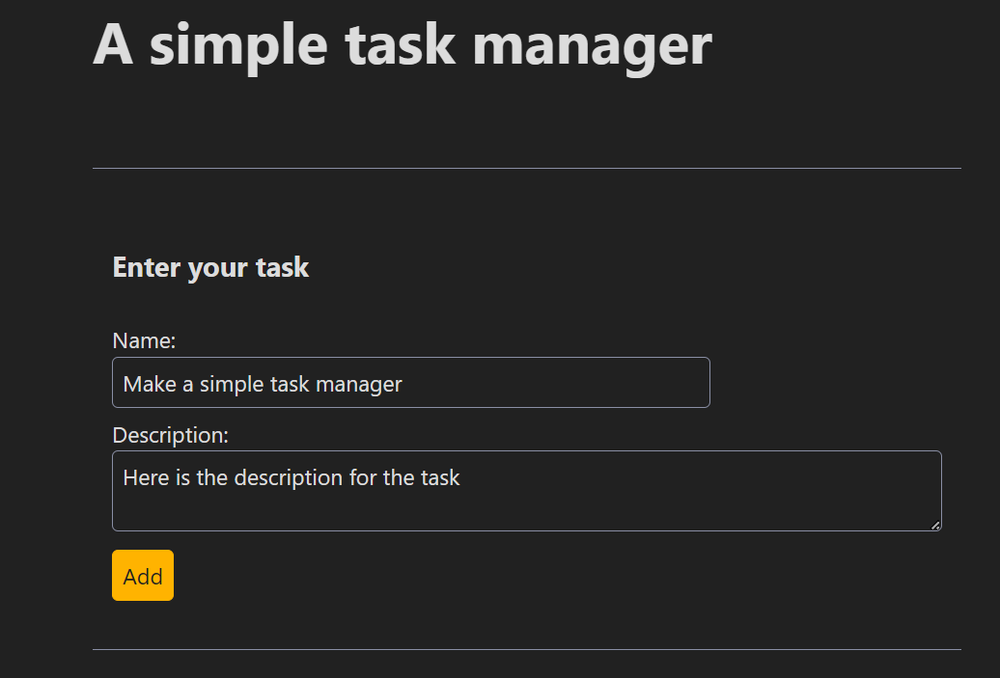
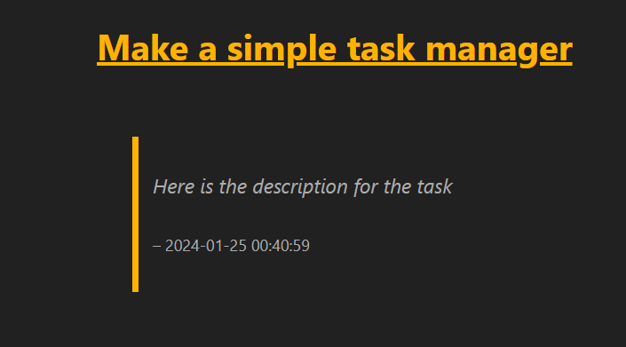
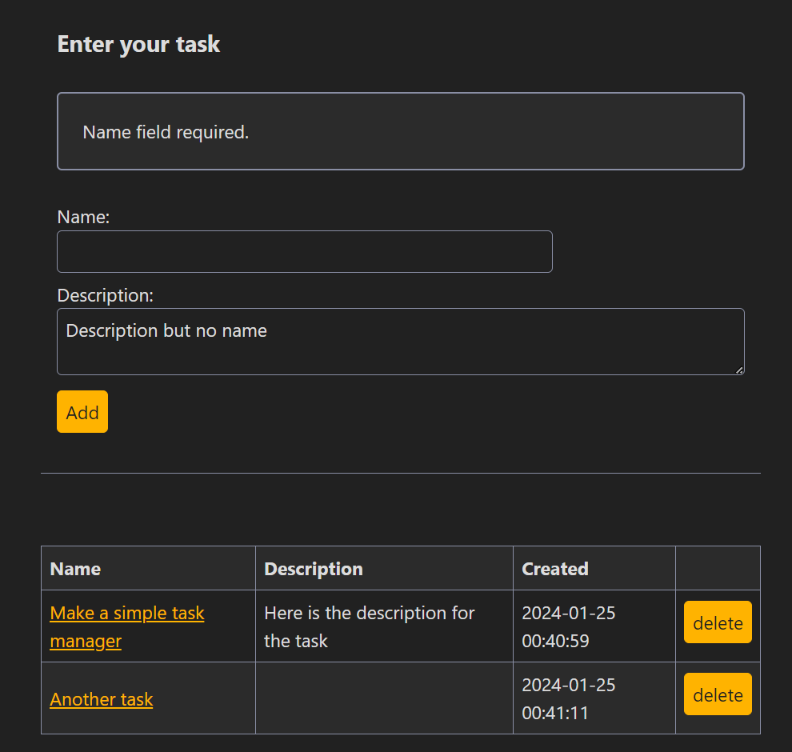
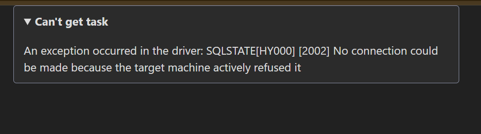

# title: A simple Task Manager app

Application for making a simple list of tasks

## Screenshots

Main screen


A single task view


Simple validation


Custom error messages


## Requirements

- PHP 8.3
- MySQL (tested on 8.0.35)

## Install

clone repository

```bash
$ git clone https://github.com/MikusR/2024-01-17-taskman.git
```

use Composer to get dependencies

```bash
$ composer install
```

copy .env.example to .env
and configure access to database

```ini
TIMEZONE = "Europe/Riga"
DBNAME = "task_manager"
USER = "taskman"
PASSWORD = "taskman"
HOST = "localhost"
DRIVER = "pdo_mysql"
```

run the application from /public directory
for example using the built-in webserver

```bash
 php -S localhost:8765 -t .\public
```

## Used packages

- doctrine/dbal (access to database)
- nesbot/carbon (better time and date)
- twig/twig (template engine)
- https://simplecss.org/ (styling)
- nikic/fast-route (for routing)
- vlucas/phpdotenv (configuration environment)

## App structure and choices

- [public/index.php](public/index.php) entry   